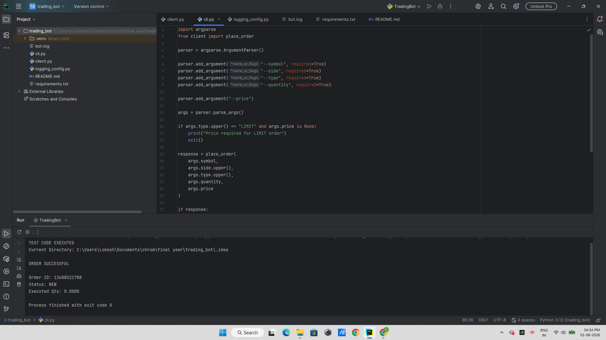
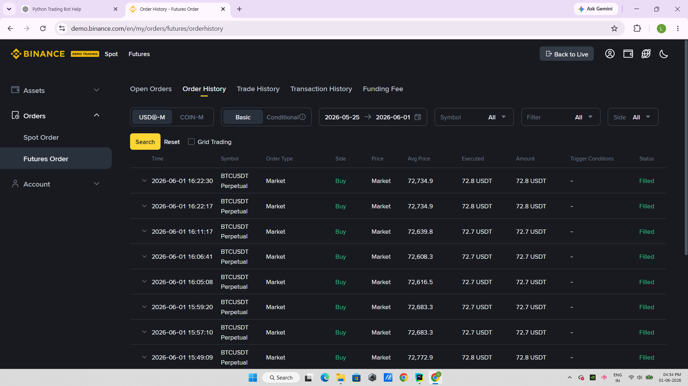
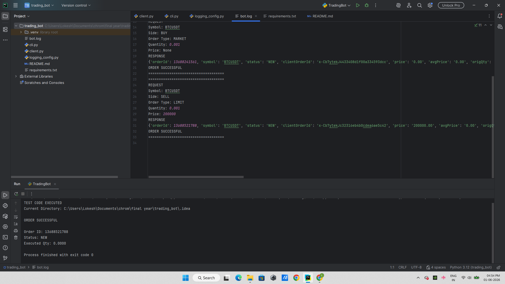

# 🚀 Binance Futures Testnet Trading Bot

A Python-based trading bot that interacts with the Binance Futures Testnet API to place MARKET and LIMIT orders through a command-line interface. The bot logs all requests and responses for monitoring and debugging purposes.

---

## 📌 Project Overview

This project demonstrates how to connect to the Binance Futures Testnet using Python and automate order placement through API integration.

### Features

* ✅ Binance Futures Testnet API Integration
* ✅ MARKET Order Execution
* ✅ LIMIT Order Execution
* ✅ Command Line Interface (CLI)
* ✅ Order Request & Response Logging
* ✅ Error Handling
* ✅ Modular Python Code Structure

---

## 🛠️ Technologies Used

| Technology              | Purpose                   |
| ----------------------- | ------------------------- |
| Python 3.x              | Core Programming Language |
| python-binance          | Binance API Integration   |
| argparse                | Command Line Arguments    |
| logging                 | Activity Logging          |
| Binance Futures Testnet | Demo Trading Environment  |

---

## 📂 Project Structure

```text
Trading-Bot/
│
├── client.py            # Binance API connection and order execution
├── cli.py               # Command Line Interface
├── logging_config.py    # Logging configuration
├── requirements.txt     # Required dependencies
├── bot.log              # Generated order logs
└── README.md
```

---

## ⚙️ Installation

### Clone Repository

```bash
git clone https://github.com/USERNAME/Trading-Bot.git
cd Trading-Bot
```

### Install Dependencies

```bash
pip install -r requirements.txt
```

---

## 🔑 Binance API Setup

1. Create a Binance Futures Testnet Account.
2. Generate API Key and Secret Key.
3. Add your credentials inside `client.py`.

Example:

```python
API_KEY = "YOUR_API_KEY"
API_SECRET = "YOUR_SECRET_KEY"
```

⚠️ Never upload your API keys to GitHub.

---

## ▶️ Running the Bot

### Market Order

```bash
python cli.py --symbol BTCUSDT --side BUY --type MARKET --quantity 0.001
```

### Limit Order

```bash
python cli.py --symbol BTCUSDT --side SELL --type LIMIT --quantity 0.001 --price 200000
```

---

## 📊 Sample Output

```text
ORDER SUCCESSFUL

Order ID: 13688241561
Status: NEW
Executed Qty: 0.0000
```

---

## 📝 Logging

Every order request and response is stored in `bot.log`.

Example:

```text
REQUEST

Symbol: BTCUSDT
Side: BUY
Order Type: MARKET
Quantity: 0.001

RESPONSE

{
    'orderId': 13688241561,
    'status': 'NEW'
}
```

---

## Screenshots

### Successful Order Execution


### Binance Futures Order History


### bot.log Output

```


```

---

## 🔄 Project Workflow

```text
User Input (CLI)
        │
        ▼
     cli.py
        │
        ▼
    client.py
        │
        ▼
 Binance Futures API
        │
        ▼
 Order Response
        │
        ▼
     bot.log
```

---

## 🎯 Key Learnings

* REST API Integration
* Cryptocurrency Trading APIs
* Python Automation
* Command Line Applications
* Logging and Debugging
* Futures Trading Concepts

---

## 👨‍💻 Author

Lokesh M

B.Tech – Artificial Intelligence & Data Science

GitHub: https://github.com/Lokesh-055
